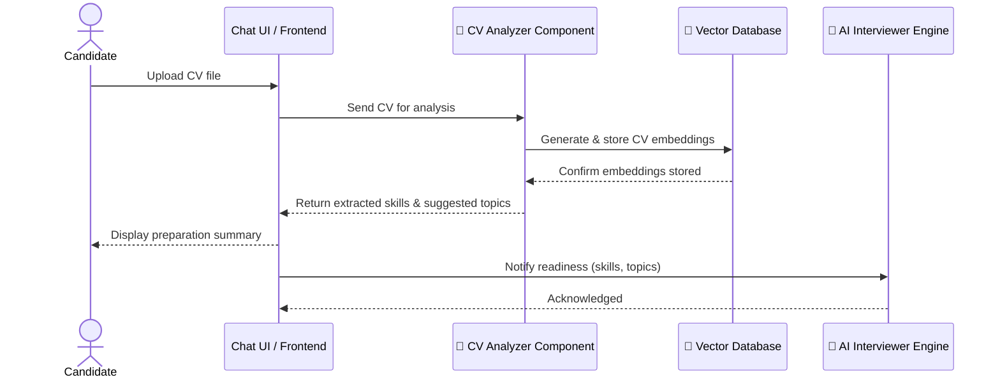
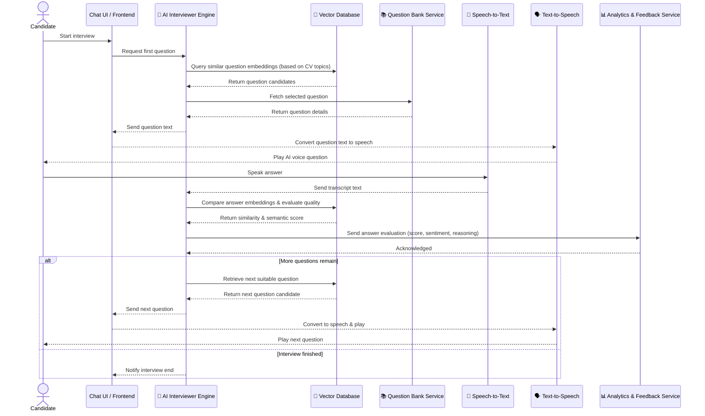
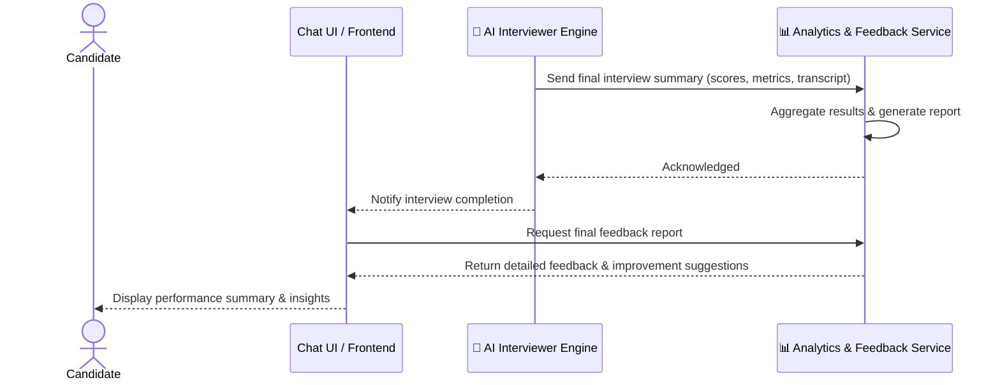

# Reource
[Schedule](https://docs.google.com/spreadsheets/d/1jdmPfl-eMlMXBo9GBmtdg-RB6Wb7JG8zn-mZxMOWLEo/edit?usp=sharing)

# Overview
Cung cấp nền tảng phỏng vấn mô phỏng có trí tuệ nhân tạo, nơi ứng viên có thể:
- Trả lời câu hỏi phỏng vấn qua chat hoặc giọng nói.
- Bộ câu hỏi được cá nhân hoá dựa trên CV và năng lực hiện tại.
- AI interviewer sinh câu hỏi, phân tích câu trả lời, và chọn câu hỏi tiếp theo dựa vào ngữ cảnh, vector DB, và dữ liệu kỹ năng. 
- Kết thúc phỏng vấn, AI interviewer sẽ đánh giá và đưa ra phản hồi chi tiết.

# Components
| #      | Thành phần                                               | Vai trò & mô tả chính                                                                                                                                                                            | Công nghệ đề xuất                                      |
| ------ | -------------------------------------------------------- | ------------------------------------------------------------------------------------------------------------------------------------------------------------------------------------------------ | ------------------------------------------------------ |
| **1**  | **AI Interviewer Engine**                                | Trung tâm điều khiển logic phỏng vấn: sinh câu hỏi, phân tích câu trả lời, chọn câu hỏi tiếp theo dựa ngữ cảnh và vector DB.                                                                     | Python + OpenAI API / LangChain / Hugging Face |
| **2**  | **📄 CV Analyzer Component (Pre-Interview Preparation)** | Phân tích CV ứng viên để chuẩn bị câu hỏi:  • Trích xuất kỹ năng, kinh nghiệm. • Sinh embedding CV để chọn câu hỏi khởi đầu phù hợp. • Gợi ý chủ đề cần đánh giá.                       | Python / LangChain / spaCy / OpenAI Embeddings         |
| **3**  | **Vector Database**                                      | Lưu trữ embedding của câu hỏi, kỹ năng, chủ đề và câu trả lời; hỗ trợ semantic search để chọn câu hỏi kế tiếp hoặc xác định năng lực.                                                            | Pinecone                           |
| **4**  | **Chat UI / Frontend**                                   | Giao diện chat realtime giữa ứng viên và AI; hỗ trợ văn bản, emoji, hiển thị kết quả đánh giá.                                                                                                   | React + WebSocket / REST                     |
| **5**  | **🎤 Voice Answer Component (Speech-to-Text)**           | Cho phép ứng viên trả lời bằng giọng nói:  • Thu âm & chuyển sang văn bản. • Hỗ trợ đa ngôn ngữ (EN, VI). • Gửi transcript đến AI Interviewer Engine.                                   | Azure Speech-to-Text API                           |
| **6**  | **🗣️ AI Voice Response Component (Text-to-Speech)**     | Cho phép AI interviewer phản hồi hoặc đặt câu hỏi bằng giọng nói:  • Chuyển văn bản sang âm thanh tự nhiên. • Hỗ trợ lựa chọn giọng nói & ngôn ngữ. • Phát audio realtime cho ứng viên. | Edge TTS (Microsoft Text-to-Speech)                |
| **7**  | **Analytics & Feedback Service**                         | Thu thập dữ liệu trả lời, đánh giá năng lực, tổng hợp phản hồi & báo cáo cuối buổi phỏng vấn.                                                                                                    | LangChain + OpenAI GPT-4 / Claude / Llama 3 để phân tích & sinh phản hồi. scikit-learn / spaCy để đánh giá ngôn ngữ và cảm xúc.                       |
| **8** | **Question Bank Service**           | Lưu trữ bộ câu hỏi phỏng vấn (technical, behavioral, situational). Cho phép tagging, versioning, fine-tuning mô hình.                                                                            | Python + PostgreSQL                   |

# Main flows
## 1. Giai đoạn Chuẩn bị (Scan CV & sinh chủ đề)

## 2. Giai đoạn Phỏng vấn (Hỏi – Đáp realtime)

## 3. Giai đoạn Kết thúc (Đánh giá & Báo cáo)

