# 1. Analyze CV and generate main questions

```mermaid
sequenceDiagram
    actor User
    participant ChatUI as Chat UI / Frontend
    participant API as FastAPI Adapter (REST/WebSocket)
    participant CVAnalyzer as 🧩 CV Analyze Adapter
    participant LLM as 🤖 LLM Adapter (AI Reasoner)
    participant VectorDB as 🧠 Vector Database Adapter
    participant DB as ðŸ—„ï¸ Persistence Adapter (PostgreSQL)

    %% Step 1: User submits CV
    User->>ChatUI: Access Interview Preparation section
    activate User
    activate ChatUI
    ChatUI->>User: Display CV upload interface

    User->>ChatUI: Upload CV file
    ChatUI->>API: Submit CV file (POST /interview/cv)
    activate API

    %% Step 2: Validate CV
    API->>API: Validate CV format & content
    alt Invalid CV format
        API-->>ChatUI: Return error ("Invalid CV format")
        ChatUI-->>User: Show validation error
    else Valid CV
        API->>CVAnalyzer: Analyze CV content (extract skills, experience, topics)
        activate CVAnalyzer
        CVAnalyzer-->>API: Extracted CV data (skills, experience level, complexity)
        deactivate CVAnalyzer
    end

    %% Step 3: Determine complexity & question count
    API->>API: Calculate number of main questions (n) based on CV complexity
    
    %% Step 4: Generate questions
    loop For each topic i = 1..n
        activate LLM
        API->>LLM: Request generate Question[i] based on skill/topic[i]
        activate LLM
        LLM->>VectorDB: Retrieve related exemplars / embeddings
        activate VectorDB
        VectorDB-->>LLM: Similar questions / references
        deactivate VectorDB
        LLM-->>LLM: generate_new_question(similar_questions[])
        LLM-->>API: Question[i] + IdealAnswer[i] + Rationale[i]
        deactivate LLM
    end

    %% Step 5: Persist results
    API->>DB: Store generated questions + answers + rationales
    activate DB
    DB-->>API: Stored successfully
    deactivate DB

    %% Step 6: Update interview status
    API->>DB: Update Interview.status = READY
    DB-->>API: Status updated

    %% Step 7: Notify user
    API-->>ChatUI: Interview setup complete (READY)
    ChatUI-->>User: Notify "Interview is ready to begin"
    deactivate API
    deactivate ChatUI
    deactivate User

```

| **Primary Actors**   | User |
| -------------------- | ---- |
| **Secondary Actors** | None |

|**Description**|As a user, I want to submit my CV so that the system can analyze it and automatically generate main interview questions based on my background and skills to prepare for a simulated job interview.|
|---|---|
|**Preconditions**|• The user is logged into the system. • The user has a CV file ready for submission.|
|**Postconditions**|• The system analyzes the CV, determines the number of main questions to generate, and prepares them for the upcoming interview. • The interview status is updated to _READY_.|

---
### **Normal Flow**
**Submit CV for Analyzing and Generating Main Questions Process**
1. The user accesses the _Interview Preparation_ section.
2. The user uploads or submits their CV file through the interface.
3. The system validates the CV file format and content.
4. The system analyzes the CV to identify skills, experience level, and topic areas.
5. The system calculates the number of main questions (_n_) based on the CV’s complexity.
6. The system generates _n_ main questions related to the identified skills and experiences.
7. For each generated question, the system also produces:
    - An ideal answer
    - A rationale or explanation (“why”) for the question
8. The system stores the generated questions and associated data.
9. The system updates the interview status to "ready".
10. The system notifies the user that the interview setup is complete and ready to begin.
---
### **Alternative Sequences / Flows**
**Step 3.1 – Invalid CV Format**
1. If the uploaded CV file format is invalid or unsupported, the system notifies the user.
2. The user submits a valid CV file.
3. Return to Step 2 of the normal flow.
---
**Step 4.1 – CV Analysis Failed**
1. If the system encounters an issue while analyzing the CV (e.g., unreadable content or processing error), the system notifies the user.
2. The user may retry submitting the CV later.
---
**Step 6.1 – Question Generation Error**
1. If the system fails to generate questions due to an internal error, the system notifies the user.
2. The interview preparation process is paused until regeneration is successful.

# 2. Real-time QA

| **Primary Actors**   | User (Candidate) |
| -------------------- | ---------------- |
| **Secondary Actors** | None             |

| **Description**    | As a user, I want to participate in a real-time Q&A session with an AI interviewer so that I can practice responding to interview questions and receive adaptive follow-up questions and feedback based on my answers. |
| ------------------ | ---------------------------------------------------------------------------------------------------------------------------------------------------------------------------------------------------------------------- |
| **Preconditions**  | • The user has completed the CV submission process and the system has generated main questions.  • The interview status is set to *ready*.                                                                          |
| **Postconditions** | • The system completes a real-time interview session covering all planned topics.  • The system records evaluation results and feedback for analysis and reporting.                                                 |

---
### **Normal Sequence / Flow**
**Real-time Q&A Process**
1. The user starts the interview session.
2. The system presents the first pre-generated question to the user through the AI interviewer interface.
3. The system uses text-to-speech to deliver the question audibly.
4. The user answers verbally.
5. The system converts the spoken response into text using the speech-to-text service.
6. The system analyzes the theoretical quality of the answer by comparing it with the ==ideal answer and the rationale==.
7. The system evaluates speaking aspects such as intonation, confidence, and fluency.
8. The system combines the theoretical and speaking evaluation results to assess the user’s overall response quality.
9. The system may generate one or more follow-up questions (m) if further elaboration or clarification is needed.
10. For each follow-up question, the process repeats:
    * The system asks a new adaptive question.
    * The user responds verbally.
    * The system re-evaluates the answer and speaking aspects.
    * The process continues until the topic is sufficiently covered or m >= 3.
11. The system records evaluation data for each question and follow-up, including reasoning and speaking trends.
12. After all topics are covered, the system ends the interview session.
13. The system generates a summary and stores the full report for review and feedback.
---
### **Alternative Sequences / Flows**
**Step 5.1 – Speech Recognition Failure**
1. If the system fails to capture or convert the spoken response, it notifies the user.
2. The user may repeat the answer.
3. Return to Step 4 of the normal flow.
---
**Step 7.1 – Speaking Analysis Unavailable**
1. If the speaking analyzer is unavailable, the system continues with theoretical evaluation only.
2. The system records the missing speaking analysis as incomplete.
3. Continue from Step 8 of the normal flow.
---
**Step 9.1 – Follow-up Generation Error**

1. If the system fails to generate adaptive follow-up questions, it proceeds to mark the topic as completed.
2. The session continues with the next topic.

```mermaid
sequenceDiagram
    actor User as Candidate
    participant ChatUI as Chat UI / Frontend
    participant API as FastAPI Adapter (WebSocket Orchestrator)
    participant Speech as 🗣️ Speech Adapter (TTS/STT)
    participant LLM as 🤖 LLM Adapter (AI Reasoner)
    participant DB as 🗄️ Persistence Adapter (PostgreSQL)

    %% Start session
    activate User
    User->>ChatUI: Start interview session
    activate ChatUI
    ChatUI->>API: Init interview session
    activate API
    API->>DB: Fetch pre-generated main questions
    activate DB
    DB-->>API: Return question set
    deactivate DB

    %% Loop for each topic/question
    loop For each main question i = 1..n
        API->>Speech: Send first question, Convert text→speech (TTS)
        activate Speech
        Speech-->>API: Audio output ready
        deactivate Speech

        par Send audio
            API-->>ChatUI: Question audio
        and Send text
            API-->>ChatUI: Question text
        end
        
        par Play audio
            ChatUI-->>User: Play question audio
        and Display text
            ChatUI-->>User: Show question text
        end
        
        User->>ChatUI: Speak answer
        ChatUI->>API: Send answer
        API->>Speech: Convert speech→text (STT)
        activate Speech
        Speech-->>API: Transcribed text
        deactivate Speech

        par Display text
            API-->>ChatUI: Transcribed text
            ChatUI-->>User: Show answer text
        and Evaluate answer request
            API->>LLM: Compare user_answer vs ideal_answer + rationale
            activate LLM
            API->>Speech: Analyze voice metrics (intonation, confidence, fluency)
            activate Speech
        end

        %% Evaluate answer
        LLM-->>API: Theoretical evaluation (semantic score)
        deactivate LLM
        Speech-->>API: Speaking evaluation (acoustic metrics)
        deactivate Speech

        API->>API: Combine theoretical + speaking results → overall_evaluation

        %% Store question evaluation
        API->>DB: Save question evaluation
        activate DB
        DB-->>API: Stored
        deactivate DB

        %% Adaptive follow-up loop
        API->>API: Set need_follow_up = true
        API->>LLM: Decide need for follow-up (based on evaluation gaps)
        activate LLM
        LLM-->>API: need_follow_up = true/false
        deactivate LLM

        API->>API: Set follow_up_count = 0
        loop while (need_follow_up == true and follow_up_count < 3)
            API->>LLM: Generate a follow-up question
            activate LLM
            LLM-->>API: follow_up_question
            deactivate LLM

            API->>Speech: Send follow_up_question, Convert text→speech (TTS)
            activate Speech
            Speech-->>API: Audio output ready
            deactivate Speech

            par Send audio
                API-->>ChatUI: follow_up_question audio
            and Send text
                API-->>ChatUI: follow_up_question text
            end
            
            par Play audio
                ChatUI-->>User: Play follow-up question audio
            and Display text
                ChatUI-->>User: Show follow-up question text
            end

            User->>ChatUI: Speak answer (follow-up)
            ChatUI->>API: Send answer (follow-up)
            API->>Speech: Convert speech→text (STT)
            activate Speech
            Speech-->>API: Transcribed text
            deactivate Speech

            par Display text
                API-->>ChatUI: Transcribed text
                ChatUI-->>User: Show answer text
            and Evaluate answer request (follow-up)
                API->>LLM: Compare user_answer vs ideal_answer + rationale (follow-up)
                activate LLM
                API->>Speech: Analyze voice metrics (intonation, confidence, fluency) (follow-up)
                activate Speech
            end

            %% Evaluate answer
            LLM-->>API: Theoretical evaluation (follow-up)
            deactivate LLM
            Speech-->>API: Speaking evaluation (follow-up)
            deactivate Speech

            API->>API: Combine theoretical + speaking results → overall_evaluation (follow-up)

            %% Store question evaluation
            API->>DB: Save question evaluation
            activate DB
            DB-->>API: Stored
            deactivate DB

            API->>LLM: Decide need for follow-up (based on evaluation gaps)
            activate LLM
            LLM-->>API: need_follow_up = true/false
            deactivate LLM

            API->>API: follow_up_count += 1
        end
    end

    %% Finalization: Generate final interview summary & feedback
    API->>DB: Get all overall_evaluations
    activate DB
    DB-->>API: overall_evaluations of interview session
    deactivate DB

    API->>LLM: Generate final interview summary & feedback
    activate LLM
    LLM-->>API: Summary report (strengths, weaknesses, improvement tips)
    deactivate LLM

    API->>DB: Store final report, update Interview.status = COMPLETED
    DB-->>API: Updated successfully

    API-->>ChatUI: Notify interview completed and show summary & feedback
    ChatUI-->>User: Display session completion + summary & feedback

    deactivate API
    deactivate ChatUI
    deactivate User
```

# 3. Final evaluation and reporting

```mermaid
sequenceDiagram
    actor User as Candidate
    participant ChatUI as Chat UI / Frontend
    participant API as FastAPI Adapter (WebSocket Orchestrator)
    participant DB as 🗄️ Persistence Adapter (PostgreSQL)
    
    activate User
    activate ChatUI
    activate API
    
    %% Generate final interview summary & feedback
    API->>DB: Get all overall_evaluations
    activate DB
    DB-->>API: overall_evaluations of interview session
    deactivate DB

    API->>LLM: Generate final interview summary & feedback
    activate LLM
    LLM-->>API: Summary report (strengths, weaknesses, improvement tips)
    deactivate LLM

    API->>DB: Store final report, update Interview.status = COMPLETED
    DB-->>API: Updated successfully

    API-->>ChatUI: Notify interview completed and show summary & feedback
    ChatUI-->>User: Display session completion + summary & feedback

    deactivate API
    deactivate ChatUI
    deactivate User
```

