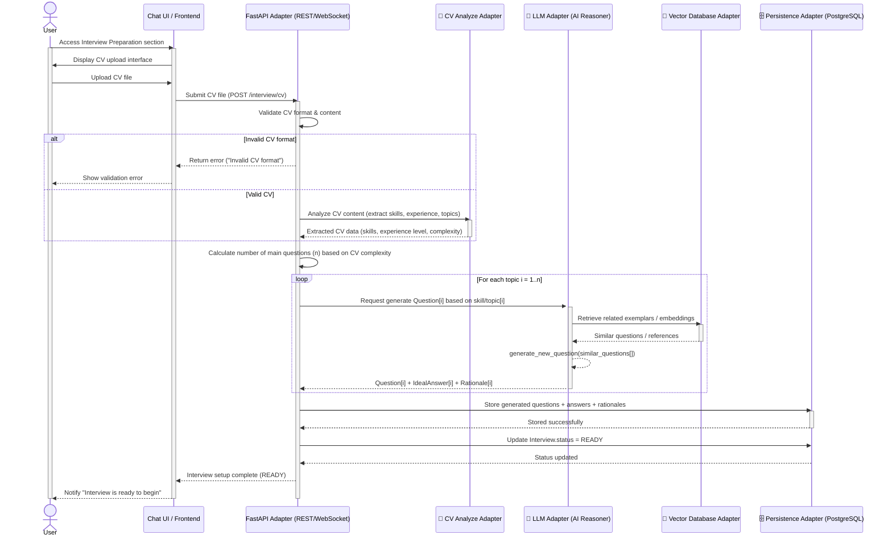

# 1. Analyze CV and generate main questions

```mermaid
sequenceDiagram
    actor User
    participant ChatUI as Chat UI / Frontend
    participant API as FastAPI Adapter (REST/WebSocket)
    participant CVAnalyzer as 🧩 CV Analyze Adapter
    participant LLM as 🤖 LLM Adapter (AI Reasoner)
    participant VectorDB as 🧠 Vector Database Adapter
    participant DB as 🗄️ Persistence Adapter (PostgreSQL)

    %% Step 1: User submits CV
    User->>ChatUI: Access Interview Preparation section
    activate User
    activate ChatUI
    ChatUI->>User: Display CV upload interface

    User->>ChatUI: Upload CV file
    ChatUI->>API: Submit CV file (POST /interview/cv)
    activate API

    %% Step 2: Validate CV
    API->>API: Validate CV format & content
    alt Invalid CV format
        API-->>ChatUI: Return error ("Invalid CV format")
        ChatUI-->>User: Show validation error
    else Valid CV
        API->>CVAnalyzer: Analyze CV content (extract skills, experience, topics)
        activate CVAnalyzer
        CVAnalyzer-->>API: Extracted CV data (skills, experience level, complexity)
        deactivate CVAnalyzer
    end

    %% Step 3: Determine complexity & question count
    API->>API: Calculate number of main questions (n) based on CV complexity
    
    %% Step 4: Generate questions
    loop For each topic i = 1..n
        activate LLM
        API->>LLM: Request generate Question[i] based on skill/topic[i]
        activate LLM
        LLM->>VectorDB: Retrieve related exemplars / embeddings
        activate VectorDB
        VectorDB-->>LLM: Similar questions / references
        deactivate VectorDB
        LLM-->>LLM: generate_new_question(similar_questions[])
        LLM-->>API: Question[i] + IdealAnswer[i] + Rationale[i]
        deactivate LLM
    end

    %% Step 5: Persist results
    API->>DB: Store generated questions + answers + rationales
    activate DB
    DB-->>API: Stored successfully
    deactivate DB

    %% Step 6: Update interview status
    API->>DB: Update Interview.status = READY
    DB-->>API: Status updated

    %% Step 7: Notify user
    API-->>ChatUI: Interview setup complete (READY)
    ChatUI-->>User: Notify "Interview is ready to begin"
    deactivate API
    deactivate ChatUI
    deactivate User

```
# 2. Real-time QA
# 3. Final evaluation and reporting
